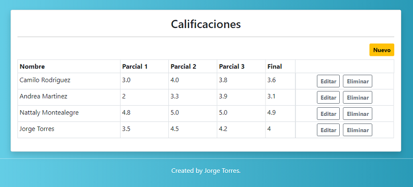

## Grades app

Grades app es una aplicación web que permite realizar CRUD vía web y API a un recurso de notas de estudiante.

## Instalación

Para hacer uso de esta aplicación siga los siguientes pasos:

1. `git clone https://github.com/jotorres060/grades-app.git`
2. `composer install`
3. Realice una copia del archivo `.env.example` y renómbrelo a `.env`
4. `php artisan key:generate`
5. Cree una base de datos, un usuario y una contraseña. Si lo desea puede crear los datos de la siguiente manera,
   tenga en cuenta que esto es solo para ambientes de prueba:
    - Base de datos => grades_app
    - Usuario => root
    - Password =>
6. Asigne los datos creados a las variables de entorno en el archivo `.env`
    - DB_DATABASE=grades_app
    - DB_USERNAME=root
    - DB_PASSWORD=
7. Por medio de una terminal de comandos y situado en el proyecto, ejecute la siguiente instrucción:  
   `php artisan migrate`
8. Abra su navegador de preferencia y escriba la ruta del proyecto hasta la carpeta `public`. Si se encuentra
   utilizando una herramienta como XAMPP puede escribir lo siguiente en el navegador:  
   `http://localhost/grades-app/public/`
   
## API

Para hacer uso de la API debe hacer uso de los siguientes Endpoints:  
    - `GET /grades-app/public/api/grades`  
    - `POST /grades-app/public/api/grades/create`  
    - `PUT /grades-app/public/api/grades/edit/{ID}`  
    - `DELETE /grades-app/public/api/grades/delete/{ID}`  
